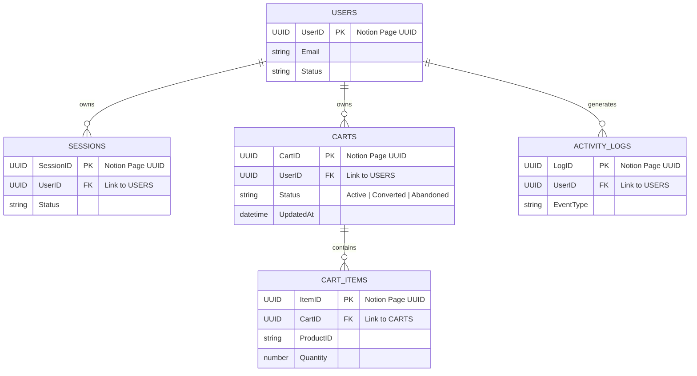

# Notion Database Schemas

This document defines the specific property schemas for the Notion databases used as the primary data store for Secundus Dermis.

## 1. Users Database
The stable, unique identifier for a user is the **Notion Page UUID**. 

| Property | Notion Type | Description |
| :--- | :--- | :--- |
| **UserID** | Title | Stores the Notion Page UUID. |
| **Email** | Email | The user's current login email. |
| **Name** | Text | The user's full name. |
| **PasswordHash** | Text | The hashed password string. |
| **CreatedAt** | Date | ISO 8601 timestamp of account creation. |
| **LastLogin** | Date | ISO 8601 timestamp of the most recent session. |
| **Status** | Select | Options: `Active`, `Archived`. |

## 2. Sessions Database
The **SessionID** is the **Notion Page UUID** of the record itself.

| Property | Notion Type | Description |
| :--- | :--- | :--- |
| **SessionID** | Title | Stores the Notion Page UUID. |
| **User** | Relation | Linked to the stable record in the **Users** database. |
| **Status** | Select | Options: `Active`, `Expired`. |
| **CreatedAt** | Date | ISO 8601 timestamp of session initiation. |
| **ExpiresAt** | Date | ISO 8601 timestamp for expiration check. |
| **UserAgent** | Text | Audit information for the client device. |

## 3. Carts Database (Header)
Represents a cart instance. Users can have multiple carts over time (e.g., historical orders).

| Property | Notion Type | Description |
| :--- | :--- | :--- |
| **CartID** | Title | Stores the Notion Page UUID. |
| **User** | Relation | Linked to the stable record in the **Users** database. |
| **Status** | Select | Options: `Active`, `Converted` (Ordered), `Abandoned`. |
| **CreatedAt** | Date | Timestamp when the cart was first created. |
| **UpdatedAt** | Date | Timestamp of the last item modification. |

## 4. CartItems Database (Line Items)
Structured records for each product in a cart.

| Property | Notion Type | Description |
| :--- | :--- | :--- |
| **ItemID** | Title | Stores the Notion Page UUID. |
| **Cart** | Relation | Linked to the record in the **Carts** database. |
| **ProductID** | Text | The unique ID of the product from the catalog. |
| **Quantity** | Number | The number of units. |
| **AddedAt** | Date | Timestamp when the item was added. |

## 5. Data Integrity & Persistence Rules

### 5.1 Stable ID Logic
By using the **Notion Page UUID** as the primary key:
- A user can update their **Email** without breaking relationships.
- All relations (Sessions, Carts, CartItems) are anchored to stable Page UUIDs.

### 5.2 "No Deletion" Policy
- **Sessions**: Updated to `Expired` via PATCH.
- **Carts**: When a user "clears" their cart without buying, the Status is set to `Abandoned`.
- **CartItems**: Items are never removed; the `Quantity` is set to `0` if the user removes it from their active view.

## 6. Relationship Diagram

